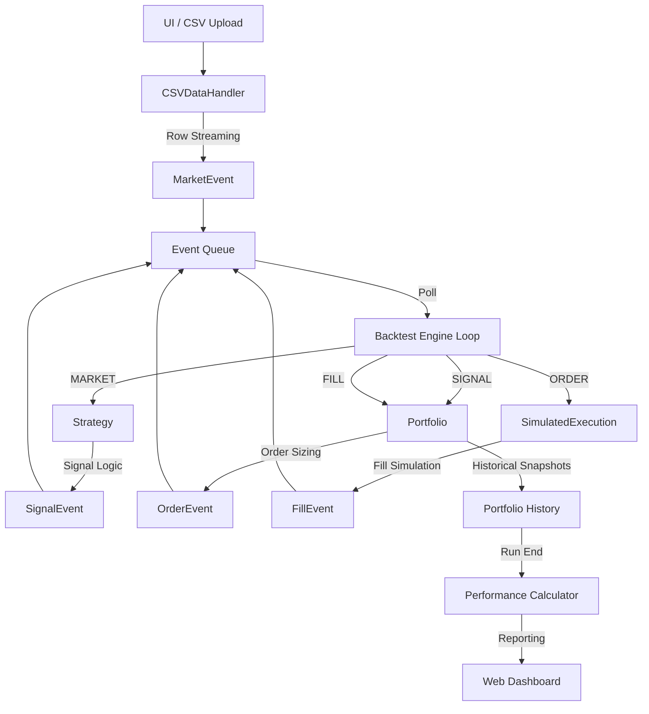

# Quantitative Trading Backtesting Engine

[](https://pyscript.net/)
[](https://www.python.org/)
[](https://opensource.org/licenses/GPL-3.0)

A high-performance, event-driven backtesting engine designed for the modern web. Built with **PyScript** and **Python**, this engine runs entirely in your browser—no backend servers or complex local environments required.

## 🚀 Key Features & USPs

- **Event-Driven Core**: Simulates trading workflows using a robust queue-based event system (`Market`, `Signal`, `Order`, `Fill`).
- **PyScript Powered**: Leverages WebAssembly (Pyodide) to execute original Python code at near-native speeds directly in the browser.
- **Zero-Backend Architecture**: All simulations, data processing, and performance calculations happen locally on the user's machine, ensuring data privacy and instant execution.
- **Streaming Row Processing**: Optimized `CSVDataHandler` streams data row-by-row to prevent memory exhaustion and eliminate "Lookahead Bias."
- **Interactive UI**: Integrated real-time trade logging and dynamic equity curve visualization using modern JavaScript charting.

## 🛠️ System Architecture

### High-Level System Flow

The engine operates on a reactive loop where components interact via an asynchronous event queue.



### Directory Structure

```text
.
├── engine.py               # Central event loop orchestration
├── event.py                # System-wide event data classes
├── data.py                 # Abstract & CSV streaming data handlers
├── strategy.py             # Base strategy and SMA crossover logic
├── portfolio.py            # Position tracking & equity management
├── execution.py            # Transaction cost & slippage simulation
├── performance.py          # Metrics (Sharpe, Max Drawdown, Win Rate)
├── web_main.py             # PyScript-UI bridge and event handling
├── index.html              # Main dashboard and PyScript runtime
├── downloader.py           # Utility for fetching market data
├── main.py                 # CLI entry point (alternative)
├── data/                   # Default datasets (AAPL, etc.)
└── strategies/             # Extensible strategy repository
```

## 📊 Performance Metrics

The engine provides a comprehensive suite of metrics calculated upon backtest completion:

- **Total Return**: Cumulative percentage change in equity.
- **Sharpe Ratio**: Risk-adjusted return metric (annualized).
- **Max Drawdown**: Maximum peak-to-trough decline.
- **Win Rate**: Percentage of profitable trading periods.

## 🚦 Getting Started

### Local Setup (Development)

1. Clone the repository.
2. Install dependencies (optional for local testing):
   ```bash
   pip install -r requirements.txt
   ```
3. Launch a local web server (e.g., Python's built-in server):
   ```bash
   python -m http.server 8000
   ```
4. Open `http://localhost:8000` in your browser.

### Cloud Usage

Simply host the project as a static site (e.g., GitHub Pages) and users can run backtests by uploading their own CSV data files.

### License

Licensed under the GNU General Public License v3.0. See the [LICENSE](LICENSE) file for details.
