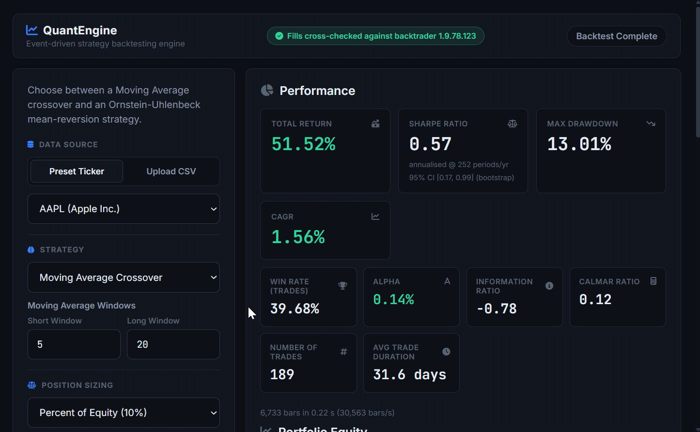
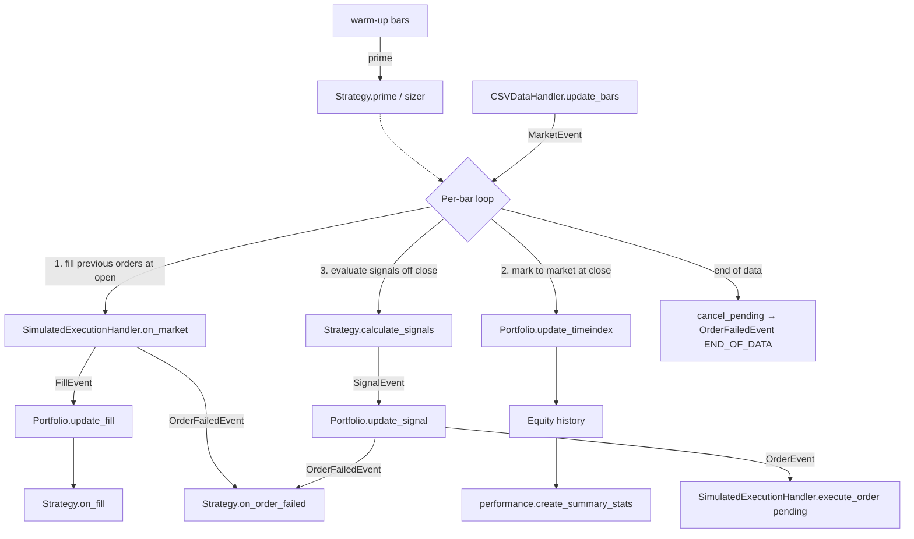

# Quantitative Trading Backtesting Engine

[](https://github.com/sahmed0/backtesting-engine/actions/workflows/ci.yml)
[](https://pyscript.net/)
[](LICENSE)

A trading-strategy simulator that also measures how much of a strategy's success
is real and how much is luck.

## [Live demo](https://backtest.sajidahmed.co.uk/)

<p align="center">
  
</p>

1. **[Overview](#part-1-overview)**: what the project is and what it found.
2. **[Technical breakdown](#part-2-technical-breakdown)**: methods, results, verification, limitations and lessons learned.
3. **[Appendix](#part-3-appendix)**: diagrams, formulas, setup instructions and references.

---

## Part 1: Overview

### What it is

A **backtest** replays historical prices and asks: "if I had followed this trading
strategy, what would have happened?" This project is a backtesting engine written in
Python that runs entirely in a web browser. Open the link, pick a stock and a
strategy, and it simulates every trade over 26 years of daily prices in under a
second. The same engine also runs from the command line, with scripts that
reproduce all of the research below.

### The problem

Backtests have a reputation for flattering the strategies they test. Three
mistakes do most of the damage:

1. **Using information from the future.** If the simulator lets a strategy trade
   at a price from before its decision could really have been made, it gets an
  advantage that does not exist in real trading.
2. **Trying many versions and keeping the best one.** Test enough settings and one
   of them will look good by luck alone.
3. **Mistaking noise for a pattern.** Prices move randomly much of the time, and a
   short stretch of random movement can look like a pattern.

### What this project does about it

- **An honest simulator.** A strategy can only trade at prices that would really
  have been available: it decides at one day's closing price and trades at the
  next day's opening price. Trading costs are included.
- **Tools that measure luck.** It re-tests strategies on years they were not tuned
  on, applies a statistical correction for having tried many settings, and checks
  whether a price pattern can be told apart from random movement.
- **Checked against known answers.** 162 automated tests, including one checked by
  hand down to the cent, and a trade-by-trade comparison with
  [backtrader](https://www.backtrader.com/), an established open-source
  backtesting library. The checks run on every code change, and the live site
  updates only if all of them pass.

### What it found (Apple stock, 2000 to 2026)

- **Re-tuning a strategy every year did no better than simply buying and holding Apple**,
  once risk is taken into account. On the Sharpe ratio, a standard measure of return
  per unit of risk, the re-tuned strategy scored 0.97 at best and buy-and-hold scored 1.06.
  The winning settings also kept changing: 10 different ones in 22 years.
- **A small timing mistake makes a strategy look far better than it is.** Letting
  the simulator trade at the start of the same day the decision was made, hours
  before the information existed, more than doubled the return and raised the
  Sharpe ratio from 0.57 to 0.99. The engine is built so this cannot happen.
- **Apple's price showed no reliable short-term "bounce-back" pattern.** A
  statistical test for a pattern passed on 4.4% of 60-day periods, about as often as it
  passes on prices generated at random (5.2%).

**Built with:** Python (NumPy, pandas), PyScript and Pyodide (Python in the browser),
JavaScript and Chart.js, pytest, GitHub Actions and Vercel.
**Areas covered:** event-driven system design, statistics for finance, testing and
verification, CI/CD and front-end development.

---

## Part 2: Technical breakdown

### 2.1 Design: the simulation loop

The engine is **event-driven**. It processes one bar (one day's open, high, low and
close) at a time, and its components (data, strategy, portfolio, execution)
communicate through events: a signal leads to an order, which leads to a fill. Within
each bar the order is fixed:

1. Fill the orders placed on the previous bar, at **this bar's open**.
2. Value the portfolio at **this bar's close**, with those fills included.
3. Let the strategy look at this close and place orders, which wait for the next bar.

Fills always happen before decisions within a bar, so a strategy can never trade at
a price it used to decide. Orders still waiting when the data ends are dropped and
counted, never filled at an invented last price. Every order that dies (the sizer
declined, not enough cash or margin, nothing to exit, no price, or the data ended)
is reported back to the strategy as an `OrderFailedEvent`, so a rejected order is
never silently lost.

A strategy tracks two things separately: what it has **asked for** (its intent) and
what has **actually filled** (its position). Decisions use intent, so a signal is
not sent twice during the one-bar wait for its fill. Fills update position.

When a run starts partway through the data, the engine first feeds the strategy and
the position sizer the bars just before the start date. Moving averages and
volatility estimates are then ready on the first live bar. These warm-up bars are
never traded or valued.

The full architecture diagram and file layout are in [Appendix A](#a-architecture).

<p align="center">
  
</p>
<p align="center"><em>Each trade on the price chart: a line joins every buy to its exit, green for a winning trade and red for a losing one.</em></p>

### 2.2 Making the simulation realistic

- **Slippage**: the gap between the expected price and the price actually paid.
  It defaults to 5 basis points (0.05%) against the trader and is applied by trade
  side: a buy pays `open × (1 + s)`, a sell receives `open × (1 − s)`. Exits are
  included. Slippage is built into the fill price and charged exactly once.
- **Commission**: `max($0.005 × shares, $1.00)` per fill, similar to Interactive
  Brokers' fixed pricing.
- **Affordability** is checked when the order fills, at the real fill price, not
  when the signal is made. A signal on Monday's close is filled at Tuesday's open,
  so checking cash against Monday's price would test a price the order never gets.
  An order that cannot be afforded is rejected whole, not reduced.
- **Short selling** needs 50% margin at entry (Reg-T style: 150% total
  collateral). The cash from a short sale is held separately and cannot be spent,
  so a sizer cannot use it to take on more positions. There are no margin calls or
  borrowing fees.
- **Reversals**: a position is always closed before the opposite one is opened.
- **Position sizing** decides how much to buy, separately from the strategy's
  decision about when. There are five sizers: fixed quantity, percent of equity,
  volatility target, fixed risk against an ATR stop, and fractional Kelly. The
  formulas are in [Appendix B](#b-position-sizers).
- **Annualisation** (turning per-day figures into yearly ones) uses the number of
  bars per year measured from the data's own dates, not a fixed 252. That makes it
  correct for stocks (about 251 per year here), Bitcoin (365) or intraday data.

### 2.3 Validation methods

**Walk-forward testing.** *Would tuning the strategy on past data have worked in the
following year?*

A moving-average crossover is tuned over a grid of 16 settings
(short window 5, 10, 15 or 20 days; long window 25, 50, 100 or 200 days), picking
the best Sharpe ratio (Sharpe, 1994) over 1,000 bars (about four years). The
chosen setting then trades the next 250 bars (about one year), and the process slides forward a year
and repeats. Joining the test years together gives one equity curve in which every
trade used settings chosen only from earlier data. Each test year starts with
fresh capital, puts 10% of equity into each new position, pays the costs above and
is warmed up first. It is compared with buy-and-hold over exactly the same days, and
with the setting a naive search over all history would pick.

**Overfitting Lab and the Deflated Sharpe Ratio.** *After trying 16 settings and
keeping the best, is the winner's Sharpe ratio more than luck?*

The history is split in time, 70% then 30%. All 16 settings are run on the first
70% and the best is chosen. Even if none of the 16 settings had any real edge,
the best of them would probably score a positive Sharpe ratio by luck.

The **Deflated Sharpe Ratio** (Bailey & López de Prado, 2014) estimates that
best-by-luck score from how many settings were tried and how much their Sharpe
ratios differ. It then gives a confidence level, from 0 to 1, that the winner's
Sharpe ratio is genuinely above that score, accounting for how long the sample
is and how skewed and fat-tailed the returns are. A value close to 1 means
selection luck is an unlikely explanation. It is a confidence level in the
same sense as (1 − p), not the probability that the strategy works.

The 16 settings are close relatives of each other, so the number of tries is also
counted as an *effective number of independent tries*, estimated from the
eigenvalues of the correlation matrix of their returns (Nyholt, 2004).
Finally, all 16 settings are run on the held-out 30% to see where the in-sample
winner ranks. The web app's Overfitting Lab does this using whatever sizing and costs
are set in the dashboard, and creates a heatmap grid to illustrate the findings.

**Mean-reversion strategy (Ornstein-Uhlenbeck).** *Does this price tend to snap back
to an average, and can that be traded?*

An Ornstein-Uhlenbeck process (Uhlenbeck &
Ornstein, 1930), a standard model of a value pulled back towards a mean, is fitted
to a rolling 60-bar window of log prices. The fit uses a regression whose results
map exactly onto the model's parameters ([Appendix C](#c-ornstein-uhlenbeck-maths)).
A trade is opened only when a Dickey-Fuller test (Dickey & Fuller, 1979) rejects
"this window is a random walk" at the chosen significance level: 1%, 5% (the
default) or 10%, using MacKinnon (2010) critical values. The strategy buys when the price is more than 2 standard deviations below
the fitted mean, and also sells short when it is that far above, if shorting is
enabled. It exits when the price returns to the mean, or at once if the latest window
shows no mean reversion at all.

A formal test is needed because the obvious check, "is the fitted pull-back speed
positive?", passes 95% of pure random walks. Least squares on a short window is
biased towards finding mean reversion that is not there.

**Measuring uncertainty.** Confidence intervals for the Sharpe ratio come from a
**stationary bootstrap** (Politis & Romano, 1994). It builds many alternative
histories by resampling blocks of consecutive returns, which keeps the
day-to-day dependence in the data. The command-line scripts use 1,000 resamples
and the browser uses 500.

### 2.4 Results

All results are for Apple (AAPL) daily prices, January 2000 to October 2026, and can
be reproduced with the commands in [Appendix D](#d-getting-started).

#### Walk-forward

`uv run python walk_forward.py AAPL`

| Same 22 test years (Oct 2004 to Aug 2026) | Sharpe | Total return | Max drawdown |
|---|---|---|---|
| Walk-forward, re-tuned every year | **0.97** (95% CI 0.51 to 1.41) | 86.95% | 5.92% |
| Buy and hold AAPL | 1.06 | 54,408.28% | 59.24% |
| SMA(5, 200), the setting chosen on all history | 0.87 | 123.15% | 10.44% |

- **Re-tuning made no clear difference.** It scored above the setting chosen with
  hindsight (0.97 against 0.87) and slightly below holding the stock (1.06), but
  both gaps are small next to the uncertainty in the walk-forward Sharpe ratio.
  The hindsight setting can still lose because it is the best single setting over
  all 26 years, not over these 22 test years, and it cannot change from year to
  year the way the re-tuned strategy can.
- **The choice of settings did not carry forward.** The optimiser picked 10
  different settings in 22 years. Out-of-sample Sharpe was lower than in-sample in
  14 of 22 years (mean 0.78 against 1.20). The median walk-forward efficiency
  (annualised out-of-sample return divided by annualised in-sample return; Pardo,
  2008) was 0.39.
- **Where the years are cut matters.** Shifting the yearly boundaries gives
  stitched Sharpe ratios between 0.72 and 0.97 across five alignments (median 0.87).
  The headline 0.97 comes from the default alignment and is the highest of the five.
- **Compare Sharpe ratios, not total returns.** Positions start at 10% of equity
  and are never topped up or trimmed, so within the test years they peaked at 24%
  of equity (median peak 13%), while buy-and-hold is always 100% invested.

#### Fill timing

`uv run python validation/fill_timing_impact.py` runs the same AAPL, SMA(5, 20),
10%-of-equity backtest three times, changing only when orders fill:

| Metric | Same close (mild look-ahead) | Same open (severe look-ahead) | Next open (honest) |
|---|---|---|---|
| Sharpe | 0.56 | 0.99 | 0.57 |
| Total return | 50.51% | 114.21% | 51.52% |
| Max drawdown | 12.53% | 9.32% | 13.01% |
| Trades | 189 | 189 | 189 |

Filling at the close the signal was computed from is a mild look-ahead, and on this
slow strategy it made almost no difference: a Sharpe ratio of 0.56 against 0.57, and a
return 1.0 percentage point *lower* over 26 years. Filling at the *same bar's open*, using a
signal from that bar's close, is severe. It lifts the Sharpe ratio from 0.57 to
0.99 and more than doubles the return. The engine always fills at the next bar's open.

#### Overfitting Lab

`uv run python overfitting_demo.py AAPL`

<p align="center">
  <br><sub>The Overfitting Lab, comparing in-sample and out-of-sample Sharpe ratios for 16 moving-average settings.</sub>
</p>

- **In sample** (Oct 2000 to Sep 2018, 4,514 bars), the best setting is SMA(5, 100),
  with an annualised Sharpe ratio of 0.89.
- **Its Deflated Sharpe Ratio is 0.999** whether all 16 settings count as separate
  tries or they are counted as 6.4 effective tries (average correlation
  between their returns is 0.79). Selection luck does not explain the in-sample
  result: with almost 18 years of daily data, even a modest Sharpe ratio is
  statistically clear.
- **Out of sample** (Sep 2018 to Oct 2026), the same setting ranks **#11 of 16**,
  with a Sharpe ratio of 0.64. The best setting there was SMA(5, 25), at 0.99.

Both findings hold at once. The strategy family worked in sample, but the specific
winning setting did not stay the winner. The Deflated Sharpe Ratio answers "is the
in-sample result more than selection luck?", not "will it last?"

#### Mean-reversion check

`uv run python validation/ou_gate_check.py` applies each check to 5,000 simulated
60-bar random walks (where any pass is a false alarm) and to every 60-bar window of
AAPL:

| Check | Random walks | AAPL |
|---|---|---|
| Sign only (fitted pull-back speed > 0) | 95.2% | 93.5% |
| Half-life under 30 bars | 84.1% | 79.5% |
| Dickey-Fuller, 10% level | 10.5% | 8.0% |
| Dickey-Fuller, 5% level | 5.2% | 4.4% |
| Dickey-Fuller, 1% level | 1.1% | 1.0% |

The Dickey-Fuller test passes random walks at close to its stated rate, as it
should. AAPL passes about as often as random walks do, so there is no evidence of
short-term mean reversion in 60-day windows. Two caveats: 60 points give the test
little power, and the 6,674 AAPL windows overlap, so they are far from independent.

### 2.5 How the results are verified

- **A test worked out by hand** ([tests/test_golden.py](tests/test_golden.py)). A
  13-bar price file runs through the real engine. Every fill price, commission and
  slippage amount, the dropped end-of-data order, the final cash and all 13 equity
  values were calculated by hand beforehand, and the test asserts them to a relative
  tolerance of 1e-12.
- **Trade-by-trade comparison with backtrader** ([validation/cross_validate.py](validation/cross_validate.py),
  backtrader pinned at 1.9.78.123). AAPL SMA(5, 20), long-only, 100 shares per
  trade, through both engines:

  | Run | Fills (ours / backtrader) | Mismatches | Final equity, relative difference |
  |---|---|---|---|
  | A: no costs (checked in CI) | 379 / 379 | 0 | 4.78e-16 |
  | B: with commission | 379 / 379 | 0 | 4.79e-16 |

  Every fill agrees on date, side, quantity and price to 6 decimal places. **What
  this covers:** next-open fill timing, moving-average warm-up alignment, long-only
  cash accounting and per-share commission. **What it does not cover:** slippage,
  short selling, margin, the position sizers, the mean-reversion strategy and the
  performance metrics. The backtrader strategy was written to mirror this engine's
  signal logic, so the signals themselves are not checked independently. Agreement
  to about 1e-16 means both engines did the same arithmetic on the same fills. See
  [validation/RESULTS.md](validation/RESULTS.md).
- **Continuous integration** ([.github/workflows/ci.yml](.github/workflows/ci.yml)).
  Every push runs four jobs:
  - linting and format checks (ruff)
  - type checks (mypy)
  - the test suite on Python 3.11 and 3.12 (all tests except one that needs
    internet access)
  - the backtrader comparison (Run A)

  A push to `main` deploys to Vercel only after all four pass.

### 2.6 Speed

- **Command line:** a full AAPL run (6,733 bars) processes about 130,000 bars per
  second (`validation/throughput.py`, CPython 3.14.5).
- **Browser (Pyodide):** the same run takes about 0.23 s, or 29,000 bars per
  second (Chrome 155). The app shows this timing after every run.

Both figures are medians of 3 runs on an Intel Core i5-12500H laptop on mains
power, running Windows 11.

### 2.7 Limitations

- **One instrument per run.** There are no multi-asset portfolios.
- **Market orders at the open only.** There are no limit orders, intraday fills or
  partial fills. Trading volume is ignored, so a large order costs the same fixed
  slippage as a small one.
- **Simplified short selling.** There are no margin calls, maintenance margin or
  borrowing fees.
- **No risk-free rate** in the Sharpe ratio. Returns are compared with zero.
- **One stock, chosen with hindsight.** Apple is one of the most successful stocks of
  the period, so results on it are not typical of stocks in general.
- **Walk-forward simplifications.** Positions are not carried across test-year
  boundaries, and the results depend on where the boundaries fall (0.72 to 0.97).
- **Confidence intervals.** The bootstrap's average block length is a rule of thumb,
  n^(1/3), not an optimised choice. The intervals do not account for the selection
  of settings or for parameter changes at year boundaries.
- **Deflated Sharpe Ratio.** The effective number of tries uses Nyholt's eigenvalue
  method, a simple stand-in for the clustering approach of López de Prado & Lewis
  (2019). Below two effective tries no deflation is applied. It counts only the 16
  settings in the grid, not earlier choices such as picking this strategy family or
  this grid.
- **Mean-reversion test power.** A 60-bar Dickey-Fuller test has little power, and
  entries ignore trading costs when deciding whether a move is large enough.

### 2.8 Challenges and lessons learned

The project went through several rounds of development, review and correction. These are the
problems that taught the most.

**Problems solved**

1. **The first version filled orders at the closing price that produced the
   signal**, a look-ahead. Orders now fill at the next bar's open (see
   [Fill timing](#fill-timing)).
   *Lesson: the fill-timing rule is the most important line in a backtester, and
   it needs a test that pins it down.*
2. **Slippage was counted twice.** It was built into the fill price and then
   subtracted from cash again, as a per-share amount treated as a dollar total.
   Exits had no slippage at all. Now slippage lives only in the fill price, and the
   unit of every cost field is written into the event definition.
   *Lesson: when a number passes between components, write its unit down and check
   it against a hand calculation.*
3. **The strategy assumed every order filled.** If an order was rejected, it
   believed it held a position it did not have and ignored later signals. Orders now
   report failures back, and the strategy tracks intent and position separately.
   *Lesson: test the unhappy paths of a state machine, not just the normal flow.*
4. **Walk-forward test years started "cold".** Each test year began with empty moving averages,
   so the strategy could not trade until its long average had filled: 24 days with a 25-day
   average, and 199 of the year's 250 days with a 200-day one. Across the 22 test years of that
   version, 1,928 of 5,500 test days (35%) were lost this way. Runs are now warmed up with
   the bars before their start.
   *Lesson: check how many bars a strategy could actually trade before trusting its results.*
5. **The first mean-reversion check passed 95% of random walks**.
   The check is now a Dickey-Fuller test, and a
   script measures every check's pass rate on random walks.
   *Lesson: test detectors on data where the right answer is known.*
6. **Some tests could never fail.** One only checked that a constructor stored its arguments. Another
   compared two return series that were identical by construction, so it could never catch an error in the benchmark-relative metrics. Both were removed or rewritten.
   *Lesson: a test is only useful if it fails when the code is wrong. Break the code on purpose to check,
   and test what the code does, not how it does it.*

Smaller fixes: cash from short sales could be spent to fund further positions (it
is now held separately, with a margin check at entry), and annualisation was fixed
at 252 trading days, which is wrong for Bitcoin and intraday data (it is now
measured from the data).

---

## Part 3: Appendix

### A. Architecture


```mermaid
graph TD
    W[warm-up bars] -->|prime| STP[Strategy.prime / sizer]
    STP -.-> M
    D[CSVDataHandler.update_bars] -->|MarketEvent| M{Per-bar loop}
    M -->|1. fill previous orders at open| X[SimulatedExecutionHandler.on_market]
    X -->|FillEvent| PF[Portfolio.update_fill]
    X -->|OrderFailedEvent| ST[Strategy.on_order_failed]
    PF --> STF[Strategy.on_fill]
    M -->|2. mark to market at close| MT[Portfolio.update_timeindex]
    M -->|3. evaluate signals off close| SG[Strategy.calculate_signals]
    SG -->|SignalEvent| US[Portfolio.update_signal]
    US -->|OrderEvent| EO[SimulatedExecutionHandler.execute_order pending]
    US -->|OrderFailedEvent| ST
    M -->|end of data| CP[cancel_pending → OrderFailedEvent END_OF_DATA]
    MT --> H[Equity history] --> PERF[performance.create_summary_stats]
```

```text
.
├── engine.py              # Per-bar event loop (fills at open, mark, signals)
├── event.py               # Frozen dataclass events, including OrderFailedEvent
├── data.py                # Single-symbol CSV streaming handler with warm-up
├── strategy.py            # Strategy base class (intent/position) + SMA crossover
├── strategies/            # Ornstein-Uhlenbeck mean-reversion strategy
├── portfolio.py           # Positions, cash, short-proceeds ledger, affordability
├── execution.py           # Next-open fills, slippage by side, commission
├── position_sizing.py     # Five position sizers
├── performance.py         # Metrics, Deflated Sharpe, stationary bootstrap
├── main.py                # Single command-line backtest
├── walk_forward.py        # Rolling walk-forward analysis
├── overfitting_demo.py    # In-sample/out-of-sample split and Deflated Sharpe
├── downloader.py          # Re-downloads the bundled data from Yahoo Finance
├── web_main.py            # PyScript ⇄ page bridge (main run + Overfitting Lab)
├── index.html             # Dashboard
├── static/                # style.css, app.js (Chart.js time-axis charts)
├── validation/            # backtrader cross-check, fill-timing, throughput and OU-check scripts
├── tests/                 # Unit, integration and hand-computed end-to-end tests
│   └── fixtures/          # GOLD.csv hand-computed fixture
└── data/                  # 12 bundled daily datasets
```

### B. Position sizers

Sizers only size new entries. An exit always closes the whole position.

| Sizer | Quantity | Settings in the web app |
|---|---|---|
| Fixed | constant `Q` | 100 units |
| Percent of equity | `fraction · equity / price` | 10% |
| Volatility target | `min(target_vol / annual_vol, max_lev) · equity / price`, with `annual_vol` from recent returns | 15% target, 20-return lookback, max leverage 1 |
| ATR-stop fixed risk | `risk_fraction · equity / (atr_multiple · ATR)`, capped at `max_lev · equity / price` | 2% risk, 14-bar ATR, stop at 2 × ATR, max leverage 1 |
| Fractional Kelly (Kelly, 1956) | `kelly_fraction · f* · equity / price`, with `f* = W − (1−W)/R` from the strategy's own completed trades (W = win rate, R = average win / average loss) | Half Kelly. Uses 2% of equity until 10 trades have completed. Fraction capped at 100%. No trade if `f* ≤ 0`. |

### C. Ornstein-Uhlenbeck maths

The process `dX = θ(μ − X)dt + σ dW` is fitted to log prices `X = ln P` over a
rolling window by least squares on

```
ΔX_t = a + b·X_{t−1} + ε_t
```

With `φ = 1 + b` this is an AR(1) process, and the exact mapping for one-bar steps
is:

```
θ = −ln φ        μ = −a / b        σ_eq = σ_ε / √(1 − φ²)
```

where `σ_ε` is the residual standard deviation (with two fitted parameters). The
common Euler shortcut `θ = −b`, `σ_eq = σ_ε/√(2θ)` is accurate only when φ is close
to 1. The windows that pass the Dickey-Fuller test are often well short of that:
the median φ is about 0.75, where the shortcut understates `σ_eq` by about 6%, so
it overstates `|z|` by about 7%.

- **Fit is valid** when `0 < φ < 1`.
- **Entry** requires the Dickey-Fuller t-statistic of `b` to be below the MacKinnon
  (2010) critical value at the chosen level, plus `|z| > entry_z`, where
  `z = (ln P_t − μ)/σ_eq`.
- **Exit** when `z` crosses `exit_z`, using the latest window's fit even if that
  window fails the test, or at once if φ leaves (0, 1).

The t-statistic matches statsmodels' `adfuller` (no lags, constant) to within
1e-12, and the critical values match statsmodels' MacKinnon tables.

### D. Getting started

The project uses [uv](https://docs.astral.sh/uv/):

```bash
uv sync                          # install runtime and dev dependencies
uv run pytest -m "not network"   # run the test suite
python -m http.server 8000       # serve the web app at http://localhost:8000
```

Besides the 12 bundled datasets, the web app accepts an uploaded CSV with the
columns `timestamp, open, high, low, close, volume`.

Command-line scripts:

```bash
uv run python main.py                              # one AAPL backtest (settings at the top of the file)
uv run python walk_forward.py AAPL [--alignments N]  # rolling walk-forward analysis
uv run python overfitting_demo.py AAPL             # in-sample/out-of-sample split and Deflated Sharpe
uv run python validation/cross_validate.py         # backtrader comparison (writes validation/RESULTS.md)
uv run python validation/fill_timing_impact.py     # fill-timing comparison
uv run python validation/ou_gate_check.py          # mean-reversion check pass rates
uv run python validation/throughput.py             # command-line speed
uv run python downloader.py                        # re-download the bundled data (needs internet)
```

### E. References

- Bailey, D. H. & López de Prado, M. (2014). The Deflated Sharpe Ratio: Correcting
  for Selection Bias, Backtest Overfitting and Non-Normality. *Journal of Portfolio
  Management*, 40(5), 94–107.
- Dickey, D. A. & Fuller, W. A. (1979). Distribution of the Estimators for
  Autoregressive Time Series with a Unit Root. *Journal of the American Statistical
  Association*, 74(366), 427–431.
- Kelly, J. L. (1956). A New Interpretation of Information Rate. *Bell System
  Technical Journal*, 35(4), 917–926.
- López de Prado, M. & Lewis, M. J. (2019). Detection of False Investment Strategies
  Using Unsupervised Learning Methods. *Quantitative Finance*, 19(9), 1555–1565.
- MacKinnon, J. G. (2010). Critical Values for Cointegration Tests. *Queen's
  Economics Department Working Paper* No. 1227.
- Nyholt, D. R. (2004). A Simple Correction for Multiple Testing for
  Single-Nucleotide Polymorphisms in Linkage Disequilibrium with Each Other.
  *American Journal of Human Genetics*, 74(4), 765–769.
- Pardo, R. (2008). *The Evaluation and Optimization of Trading Strategies* (2nd
  ed.). Wiley.
- Politis, D. N. & Romano, J. P. (1994). The Stationary Bootstrap. *Journal of the
  American Statistical Association*, 89(428), 1303–1313.
- Sharpe, W. F. (1994). The Sharpe Ratio. *Journal of Portfolio Management*, 21(1),
  49–58.
- Uhlenbeck, G. E. & Ornstein, L. S. (1930). On the Theory of the Brownian Motion.
  *Physical Review*, 36(5), 823–841.
- backtrader 1.9.78.123: <https://www.backtrader.com/>

### F. Licence

© 2026 Sajid Ahmed. Licensed under the MIT License. See [LICENSE](LICENSE).
