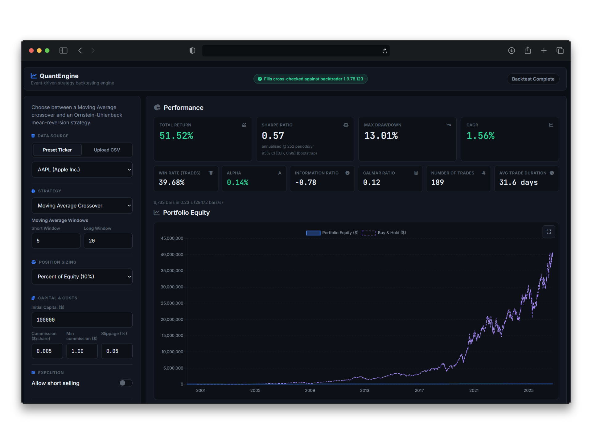
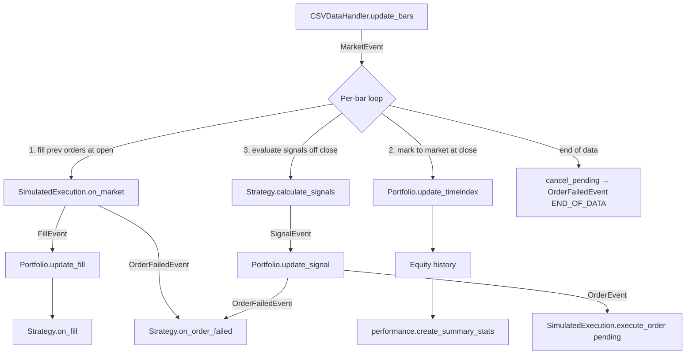
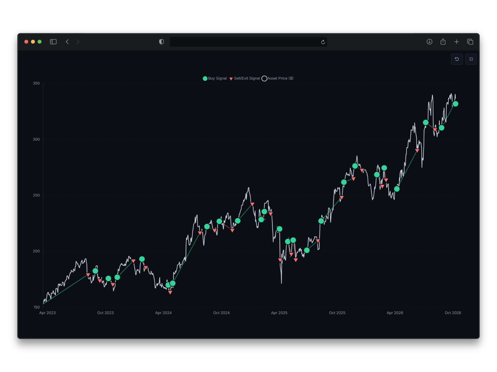

# Quantitative Trading Backtesting Engine

[](https://github.com/sahmed0/backtesting-quant-engine/actions/workflows/ci.yml)
[](https://pyscript.net/)
[](https://opensource.org/licenses/GPL-3.0)

An event-driven backtesting engine whose point is not the backtest but the
*research layer around it*: it measures how much of a strategy's apparent edge is
selection bias, look-ahead, or sampling noise — and reports what is left. It runs
entirely in the browser via PyScript (Pyodide), with no backend. Signals are
computed at the close of bar *t* and orders fill at the open of bar *t+1*, so the
engine never transacts at a price the strategy had already used to decide.

## 🖥️ [Live demo](https://sajidahmed.co.uk/backtesting-quant-engine/)

<p align="center">
  
</p>

## Overfitting Lab

The lab grid-searches SMA parameters in-sample, then shows where the in-sample
winner lands out-of-sample and quantifies the selection bias with a **Deflated
Sharpe Ratio** (Bailey & López de Prado, 2014).

The DSR asks: after trying *N* configurations and keeping the best, what is the
probability its Sharpe is genuinely positive rather than the luckiest draw of *N*?
On AAPL the in-sample winner is SMA(10, 200) at an annualised Sharpe of 0.83; over
the 16 configurations tried its **DSR is ≈ 1.00** — it barely clears the 0.95 line,
so its edge is only marginally distinguishable from selection noise.

## Walk-forward results

`python walk_forward.py AAPL` slides an (optimise 1000 bars → test 250 bars) pair
across the whole history and stitches every out-of-sample segment into one curve
whose every point was traded on parameters chosen only from prior data:

```
Per-fold in-sample vs out-of-sample Sharpe (same parameters):
  Mean IS Sharpe:    1.18      Mean OOS Sharpe:   0.59
  OOS worse than IS in 15 of 22 folds.
  The optimiser picked 9 different parameter sets across 22 folds.

Stitched out-of-sample equity curve (the realistic, tradeable result):
  Sharpe   0.79   Return   44.58%   MaxDD   6.64%   over 5478 OOS bars
  Bootstrap 95% CI on OOS Sharpe: [0.34, 1.23]

For contrast, a single naive optimisation over all 6599 bars  SMA(5,200):
  Sharpe   0.77   Return  178.21%   MaxDD  16.36%   <- in-sample, optimistic

  Average per-fold walk-forward efficiency: -0.11  (OOS return / IS return)
```

The honest, walk-forward return (44.6%) is a quarter of the naive in-sample figure
(178%); the parameter "best" is unstable (9 sets over 22 folds) and per-fold
efficiency is negative — most of the naive edge was fitted to noise. The bootstrap
95% CI on the stitched Sharpe [0.34, 1.23] still straddles well above zero.

## Execution realism

`python validation/fill_timing_impact.py` runs the same AAPL / SMA(5, 20) /
10%-equity backtest twice, changing only the fill timing:

| Metric        | same-bar fills (look-ahead) | next-open fills | delta   |
|---------------|-----------------------------|-----------------|---------|
| Sharpe        | 0.55                        | 0.55            | 0.00    |
| Total Return  | 48.00%                      | 48.61%          | +0.62%  |
| Max Drawdown  | 12.52%                      | 12.99%          | +0.48%  |
| # Trades      | 186                         | 186             | 0       |

For a *slow* SMA crossover on daily data the look-ahead is nearly worthless:
crossovers fire mid-trend, where the next open sits close to the signal close.
That is itself the finding — the look-ahead bias that flatters naive engines is
large only for strategies that trade at a bar's extreme; here honest fills change
the headline by well under 1%. The engine fills at next-open regardless, and drops
(and counts) any order still pending when the data ends rather than inventing a
last-bar fill.

## Strategies

**Ornstein-Uhlenbeck (mean reversion).** The SDE `dX = θ(μ − X)dt + σ dW` is fit on
**log-prices** `X = ln P` via its AR(1) discretisation `ΔX_t = a + b·X_{t-1} + ε`,
giving `θ = −b` and `μ = a/θ`. Trading is gated on `θ > 0` (a non-mean-reverting or
random-walk window is skipped), the equilibrium spread is `σ_eq = σ/√(2θ)` (residual
`σ` with `ddof=1`), and the z-score `z = (ln P_t − μ)/σ_eq` is scale-invariant.
Enter when `|z| > entry_z`, exit when `z` crosses `exit_z`.

**SMA crossover.** Long (optionally also short) on a fast/slow simple-moving-average
crossover, tracked by intent so a signal is not re-emitted while its fill is pending.

## Position sizing

| Sizer | Quantity |
|-------|----------|
| Fixed | constant `Q` |
| Percent of equity | `fraction · equity / price` |
| Volatility target | `min(target_vol / annual_vol, max_lev) · equity / price` |
| ATR-stop fixed risk | `risk_fraction · equity / (atr_multiple · ATR)`, capped at `max_lev · equity / price` |
| Fractional Kelly | `kelly_fraction · f* · equity / price`, `f* = W − (1−W)/R` |

## Modeling assumptions & limitations

| Area | Assumption |
|------|-----------|
| Fill timing | Signal at close of bar *t*, fill at open of bar *t+1*. Orders pending at end of data are dropped and counted (`dropped_orders`) — never force-filled. |
| Slippage | Percentage of the open, applied by trade **side**: BUY pays `open·(1+s)`, SELL receives `open·(1−s)` (EXITs included); default 5 bps. Embedded in the fill price and reported in dollars, never charged twice. |
| Commission | `max(commission_per_share · qty, min_commission)` total $ per fill; defaults $0.005/share, $1.00 min (IBKR-style). |
| Short margin | Entry needs `cash ≥ 0.5·notional + commission` (Reg-T 150% collateral), checked at fill time; proceeds are segregated, not spendable cash. **No** maintenance margin, margin calls, or borrow cost. |
| Scope | **Single symbol per run** — `CSVDataHandler` rejects ≠ 1 symbol. Multi-asset is out of scope. |
| Sharpe | No risk-free rate (excess return = raw return). |
| Annualisation | Periods/year **inferred from the bar timestamps** (bar density), not a fixed 252 — correct for daily, hourly, or 24/7 data. |

## Architecture

The engine drives a fixed per-bar sequence: fill the previous bar's orders at this
bar's **open**, mark the portfolio to market at this bar's **close**, then evaluate
signals off that close. Any order that dies (sizer declined, insufficient cash or
margin, no price, end of data) emits an `OrderFailedEvent` back to the strategy.


```mermaid
graph TD
    D[CSVDataHandler.update_bars] -->|MarketEvent| M{Per-bar loop}
    M -->|1. fill prev orders at open| X[SimulatedExecution.on_market]
    X -->|FillEvent| PF[Portfolio.update_fill]
    X -->|OrderFailedEvent| ST[Strategy.on_order_failed]
    PF --> STF[Strategy.on_fill]
    M -->|2. mark to market at close| MT[Portfolio.update_timeindex]
    M -->|3. evaluate signals off close| SG[Strategy.calculate_signals]
    SG -->|SignalEvent| US[Portfolio.update_signal]
    US -->|OrderEvent| EO[SimulatedExecution.execute_order pending]
    US -->|OrderFailedEvent| ST
    M -->|end of data| CP[cancel_pending → OrderFailedEvent END_OF_DATA]
    MT --> H[Equity history] --> PERF[performance.create_summary_stats]
```

```text
.
├── engine.py            # Per-bar event loop (fills-at-open, mark, signals)
├── event.py             # Frozen dataclass events + OrderFailedEvent
├── data.py              # Single-symbol CSV streaming handler
├── strategy.py          # Strategy ABC (intent/position) + SMA crossover
├── strategies/          # OU mean-reversion strategy
├── portfolio.py         # Positions, cash, short-proceeds ledger, sizing
├── execution.py         # Next-open fills, slippage-by-side, commission
├── position_sizing.py   # Five position sizers
├── performance.py       # Metrics, DSR, stationary-bootstrap CIs
├── web_main.py          # PyScript ⇄ DOM bridge (main run + overfitting lab)
├── index.html           # Dashboard shell
├── static/              # style.css, app.js (time-axis charts)
├── validation/          # backtrader cross-check + impact/throughput scripts
├── tests/               # Unit + golden end-to-end tests
│   └── fixtures/         # GOLD.csv hand-computed fixture
└── data/                # Default datasets (AAPL, BTC-USD, …)
```

## Validation

- **Golden test** (`tests/test_golden.py`): a hand-computed 13-bar fixture run
  through the real stack, asserting every fill price, commission, the cash
  trajectory, and the full equity curve to the penny.
- **Cross-validation against backtrader** (`validation/cross_validate.py`, pinned
  `1.9.78.123`, gated in CI): AAPL SMA(5, 20) through both engines.

  | Run | Trades (ours / bt) | Mismatches | Equity rel. delta |
  |-----|--------------------|------------|-------------------|
  | A — zero cost (gate) | 372 / 372 | 0 | 2.50e-16 |
  | B — with costs | 372 / 372 | 0 | 2.51e-16 |

  Both engines fill at the next bar's open, so every fill agrees to 6 dp. See
  [validation/RESULTS.md](validation/RESULTS.md).
- **CI** (`.github/workflows/ci.yml`) gates the GitHub Pages deploy on ruff, mypy,
  the full pytest suite (Python 3.11 & 3.12), and the backtrader cross-check.

## Performance

A full AAPL run (6,599 bars) processes at a **median ≈ 118,000 bars/sec** on the CLI
(CPython, median of 3 runs via `python validation/throughput.py`).

<p align="center">
  
</p>

## Getting started

The project uses [uv](https://docs.astral.sh/uv/):

```bash
uv sync                       # install runtime + dev dependencies
uv run pytest -m "not network" # run the test suite
python -m http.server 8000    # serve the app at http://localhost:8000
```

CLI entry points: `python main.py` (single run), `python walk_forward.py AAPL`
(rolling walk-forward), `python overfitting_demo.py AAPL` (in/out-of-sample split).

### License

Licensed under the GNU General Public License v3.0. See the [LICENSE](LICENSE) file
for details.
